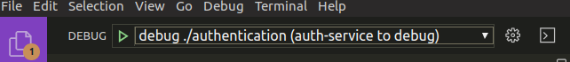
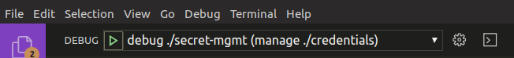
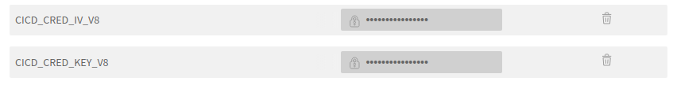

# Getting Started
**STEP 1** - install **ALL** project dependencies this can easily be done in vscode by pressing: 
 - `ctrl + p`
 - then, `>`
 - select `Tasks: Run Tasks` & press `Enter`
 - select `install-dependencies` & press `Enter`
 - select `continue without scanning the task output` & press `Enter`  

**STEP 2** - in .vscode select action from the debug dropdown and click the green &#x25b6; icon, see screenshot below:  


# Rotating Authentication Credentails
**STEP 1** - retrieve the .credential.zip file from whereever your organization keeps this and extract the zip file to `./auth-service`  

**STEP 2**: Run `./secrets-mgmt` by clicking .vscode debug button, see screenshot  
  

**STEP 3**: Take the newly create production key and iv and store in travis, see [Travis](#Travis)  

**STEP 4**: Store the newly rotated credentials run  `$ zip -re credentials.zip .credentials-v{CURRENT_VERSION_NUMBER}` from `./auth-service`*
- *NOTE: To generate random password for the zip `$ openssl rand -hex 6` and store safely, only share with authorized team members*  

**STEP 5**: Commit the rotated credentials to the github repo. 

## Secrets & Environment Variables
Secrets are encrypted and managed directly as part of this project in ./secret-mgmt. Manageing secret encryption at the application layer was 
chosen as the primary method to
* enable a method that allows our CICD pipeline to manage secrets for deployment in an encrypted format 
* remain cloud independent (ie: as compared to using AWS or Gcloud secret manager) in the event we rehost in the furtue to IBM Cloud or others
* Since our containers run in Kubernetes we can take advantage of kubernetes secret manger to store and serve up secrets to the container in kubernetes we can take advantage of secret manager

See specifc details about each secret in the extracted `./.credentials-v{VERSION_NUMBER}/README.md`. Instructions to extract human readable credentials - see STEP 1 of [Rotating Authentication Credentails](#Rotating-Authentication-Credentails).

## CI/CD
Environment variables are stored in an encrypted format via AES-128 in the IBM private github repo. Example: see following screenshot  
  

### Travis 
Travis maintains secrets to decrypt the CICD file and is not readable from the console. Example: see following screenshot from https://travis.ibm.com/gftn/gftn-services/settings  
    
The iv and key from the screenshot above must be uploaded manually by the developer rotating the credentials. the `../.travis.yml` makes reference to these decryption keys stored in travis. To rotate, see To rotate these see [Rotating Authentication Credentails](#Rotating-Authentication-Credentails)
 
# API Architecture (Application Layer)

## Overview 
The application level architecture for this API utilizes a controller based approach to contain the logic for all endpoints. Javascript annotations above the methods in the controller are used by TSOA to generate swagger documentation. See more about TSOA below. A config.ts file manages the setup of the nodejs application. The middleware.ts contains all the middleware logic for this application (TODO: Need to migrate middleware.ts logic to authentication.ts to be consistent with TSOA methodology and Swagger generator for authentication related documentation.) 

Following videos explain methodology used...  
see https://www.youtube.com/watch?v=CccZCy4eth4,  
and https://www.youtube.com/watch?v=o_TH-Y78tt4

## What is TSOA?
TSOA is a library that works with typescript and express to implement an API that automatically generates Swagger files. 

## Goal of TSOA:
from https://github.com/lukeautry/tsoa

- TypeScript controllers and models as the single source of truth for your API
- A valid swagger spec is generated from your controllers and models, including:
    - Paths (e.g. GET /Users)
    - Definitions based on TypeScript interfaces (models)
    - Parameters/model properties marked as required or optional based on TypeScript (e.g. myProperty?: string is optional in the Swagger spec)
    - jsDoc supported for object descriptions (most other metadata can be inferred from TypeScript types)
- Routes are generated for middleware of choice
    - Express, Hapi, and Koa currently supported, other middleware can be supported using a simple handlebars template
    - Validate request payloads

## Philosophy of TSOA:
from https://github.com/lukeautry/tsoa

- Rely on TypeScript type annotations to generate API metadata if possible
- If regular type annotations aren't an appropriate way to express metadata, use decorators
- Use jsdoc for pure text metadata (e.g. endpoint descriptions)
- Minimize boilerplate
- Models are best represented by interfaces (pure data structures), but can also be represented by classes


### TSOA (Automated Documentation and Routing with Typescript)
tsoa generates the following files :
1. `routes.ts` based on typescript decorators (decorators start with __@...__ )
```bash
# generate routes.ts with:
$ tsoa routes
```
2. `swagger.json` output in ./def, see 
```bash
# Generate swagger.json (v2.0)
$ tsoa swagger
```

#### TSOA github issues:   
handling error: https://github.com/lukeautry/tsoa/issues/150   
set status: https://github.com/lukeautry/tsoa/issues/32

#### TSOA Response types
```typescript
    // the following is valid and will generate a swagger.json description with multiple return types
    @Response<any>('404', 'Unable to find account. Try a different public key.') // error response
    @Response<any>(400, 'other description')
    @Response<any>(401, 'even another description')
    @SuccessResponse('200', 'Success, retrieved account details.')
    @Get('getAccountDetails/{publicKey}')
    public async getAccountDetails(publicKey: string) {
    //... 
        // set the status
        this.setStatus(404);
        resolve(error);
    }
```

# Running Unit Test Cases

In order to run the unit test cases for auth service and `env.go` file is required which has userIDs and institution IDs for running these test cases.

Place the file in the `authorzation` directory of the `auth-service`.

To run the full test suite run the `test` script.
In order to run a single test case use the command

```
go test -run $(TEST_NAME)
```

Example :

```
go test -run TestServiceCheck
```


<!-- # TODO: GCLOUD Security WIP, uncomment below
# Google Cloud Security 

## Cloud Endpoints vs. Cloud Armor
Cloud Endpoints and Cloud Armor offer additional mechanisms to protect your API.
Unfortunately, as of writing this `Cloud Armor` is not available on GAE (only GKE). As such,
Cloud Armor is not an option for deployment unless we move to GKE. Alternatively, we can use 
`Cloud Endpoints` to secure specific endpoints. Cloud Endpoints uses the 
`ESP` (https://cloud.google.com/endpoints/docs/openapi/glossary#extensible_service_proxy) 
a high-performance, scalable proxy that runs in front of an OpenAPI backend (GAE) and provides 
API management features such as authentication, monitoring, and logging.
see Cloud Endpoints (available for GAE) - https://cloud.google.com/endpoints/docs/openapi/get-started-app-engine  
see Cloud Armor (NOT available for GAE) - https://cloud.google.com/armor/

see how to configure Cloud Endpoints for firebase users - https://cloud.google.com/endpoints/docs/openapi/authenticating-users-firebase
see how to configure Cloud Endpoints for custom JWT validation - https://cloud.google.com/endpoints/docs/openapi/troubleshoot-jwt

### Cloud Endpoints Setup
1. Configure endpoints - https://cloud.google.com/endpoints/docs/openapi/get-started-app-engine#endpoints_configure
2. Deploy endpoints - https://cloud.google.com/endpoints/docs/openapi/get-started-app-engine#deploy_configuration 
3. Create API Key - https://cloud.google.com/endpoints/docs/openapi/get-started-app-engine#send_request

### Creating API Key in GCloud 
Use of API keys allow **restrictions** by IP Address and access to gcloud services. To authenticate to the google IAM api you ideally should use a `Service Account` credential to authenticate. See usage here: https://cloud.google.com/endpoints/docs/openapi/restricting-api-access-with-api-keys#sharing_apis_protected_by_api_key

- For Production Deployments - 
Application is running on Compute Engine, Kubernetes Engine, App Engine, or Cloud Functions do NOT require
separtate additional procedure to authentciate to Service Accounts, it is implicit, see
https://cloud.google.com/docs/authentication/production#finding_credentials_automatically. The previous 
procedure can be used for Production deployments. 

- For Development Builds -
You must set the environment variable to point to the `Service Account` credential file  via `$ export GOOGLE_APPLICATION_CREDENTIALS="/home/user/Downloads/[FILE_NAME].json"`, see https://cloud.google.com/docs/authentication/getting-started#setting_the_environment_variable

## Cloud Scanner
Cloud Security Scanner is a web security scanner for common vulnerabilities in App Engine. It can automatically scan and detect four common vulnerabilities, including cross-site-scripting (XSS), Flash injection, mixed content (HTTP in HTTPS), and outdated/insecure libraries. You can easily setup, run, schedule, and manage security scans and it is free for Google Cloud Platform users.
see https://cloud.google.com/security-scanner/docs/quickstart

### Google API Libaray https://console.cloud.google.com/apis/library?folder=&organizationId=&project=chase-endpoints -->
