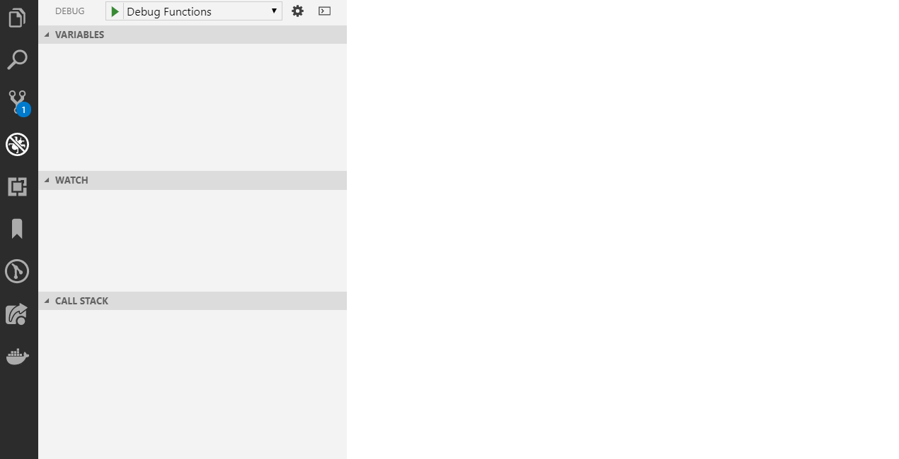

# Website/Portal for IBM Blockchain WorldWire

# IBM Design Links
* IBM Carbon Design Spec http://www.carbondesignsystem.com/
* IBM Plex Font https://fonts.google.com/featured/Plex
* IBM Blockchain Assets http://ibm.biz/BCMktgMssg

# Build for Development (Steps to build locally)

STEP  1. **Clone WorldWire Portal & Authentication Service**
```bash
# clone portal
$ git clone https://github.com/GFTN/gftn-web.git
# clone entire repo of gftn micro services including "auth-service"
$ git clone https://github.com/GFTN/gftn-services
```

STEP 2. **Open code repositories in VSCode**
```bash
# open vs code editor for portal
$ code .../gftn-web
# open vs code editor for auth-service
# NOTE: "auth-service" should be in goPath if you want to run the
# "auth-service/demo_authorization" will run
$ code .../go/src/github.com/GFTN/gftn-services/
```

STEP 3. **Obtain VSCode Launch & Task Files for auth-service**
The `.vscode/launch.json` and `.vscode/task.json` files must be obtained from your.user@your.domain. These files contain sensitive environment variables that should **NOT** be pushed up to github but are necessary to the code to run. Please ensure that these files are obtained and placed within the root `.../go/src/github.com/GFTN/gftn-services/auth-service/.vscode/launch.json` and `.../go/src/github.com/GFTN/gftn-services/auth-service/.vscode/task.json`

STEP 4.0 (ONE TIME ONLY) install typescript and node_modules
`$ npm i -g typescript # install typescript globally`
`$ npm i # install dependencies ie: node_modules `

STEP 4.1 **Build World Wire Portal Website for 'development' using angular**
Run `$ ng serve` for a dev server. Navigate to `http://localhost:4200/home`. The app will automatically reload if you change any of the source files.

STEP 5. **Start the Authentication Service**
Using the `.vscode/launch.json` the user should be able to run the Node.js service locally
<!-- Gif made with https://www.screentogif.com/ -->


STEP 6. **Login to portal using auth-service**


STEP 7. **END (you have signed-in using the auth-service...)**


# Other Build Instructions

## Production Build

Run `$ ng build --configuration={env}` (where `{env}` is 'dev', 'qa', 'staging', 'test' or 'prod') to build the project for their respective environments. The build artifacts will be stored in the `dist/` directory.

<!-- ## Running unit tests -->

<!-- Run `ng test` to execute the unit tests via [Karma](https://karma-runner.github.io). -->

<!-- ## Running end-to-end tests -->

<!-- Run `ng e2e` to execute the end-to-end tests via [Protractor](http://www.protractortest.org/). -->

## Angular Architecture

### Creating Data Models

Data models such as that `Participant.ts` is defined as a angular service. Each instance of a model should be consumed by a component
as it's own injected service provider. This means that other components in the containing ngModule cannot access the same instance of the service being provided.
See discussion at https://angular.io/guide/providers

### Limiting provider scope with components
Another way to limit provider scope is by adding the service you want to limit to the component’s providers array. Component providers and NgModule providers are independent of each other. This method is helpful for when you want to eagerly load a module that needs a service all to itself. Providing a service in the component limits the service only to that component (other components in the same module can’t access it.)

# Angular
This project uses Angular for building the portal/website.
Please see [angular docs](angular.io) or [angular cli for scaffolding](cli.angular.io)

# Firebase
This project uses firebase services for authentication, real-time database, storage, pubSub and cronJobs.
See [firebase docs](https://firebase.google.com)

## Debugging Google Functions (via Google Functions Emulator)
> Install -  `npm install -g @google-cloud/functions-emulator`

See [Debugging Google functions with VS Code](https://github.com/GoogleCloudPlatform/cloud-functions-emulator/wiki/Debugging-with-Visual-Studio-Code)

See [Calling Google functions](https://github.com/GoogleCloudPlatform/cloud-functions-emulator/wiki/Calling-functions)

See [Debugging Firebase functions with VS Code](https://medium.com/@mwebler/debugging-firebase-functions-with-vs-code-3afab528bb36)


> Note: The Emulator currently requires Node.js >= 6.11.1. Note that the Node.js Emulator only works with Cloud Functions written for the Node.js 6 runtime.

> Use nvm to target the another node version: [nvm for OSX & Linux](https://github.com/creationix/nvm) and [nvm for windows](https://github.com/coreybutler/nvm-windows)


``` bash
# must be in directory containing your functions
$ C:\...\gftn-web> cd functions

# start the google functions emulator
$ C:\...\gftn-web\functions> functions start

# deploy function on locally running port
$ C:\...\gftn-web\functions> functions deploy api --trigger-http --timeout 600s

# provides the locally deployed functions details (eg: running port/url)
$ C:\...\gftn-web\functions> functions describe api

# starts debug in node
$ C:\...\gftn-web\functions> functions inspect api
# now set a break point in VSCode on /test
# then use postman to call http://localhost:8010/next-gftn/us-central1/api/test
```

## Running Firebase Functions & Triggers (via Firebase-tools Emulator)
See [Firebase local emulator](https://firebase.google.com/docs/functions/local-emulator)

### Firebase Shell
For locally calling and invoking functions:
Use the firebase shell `firebase functions:shell` and invoke a function:

#### Realtime Database
```bash
# make sure you're running these commands from the functions folder
$ cd functions

# start the functions
$ firebase functions:shell

# invoke
$ api.get('test')
```

See [Invoke Realtime Database functions](https://firebase.google.com/docs/functions/local-emulator#invoke_realtime_database_functions)


#### Pub/Sub Invocation
```bash
# make sure you're running these commands from the functions folder
$ cd functions

# start the functions
$ firebase functions:shell

# invoke
$ updateNodeStatus({data: new Buffer('{"hello":"world"}'), attributes: {foo: 'bar'}})
```
See [Invoke pub/sub (cron job) functions](https://firebase.google.com/docs/functions/local-emulator#invoke_pubsub_functions)

If you see this warning use NVM to make sure you are targeting a compatible node version.
> Warning: You're using Node.js v8.12.0 but Google Cloud Functions only supports v6.11.5.
> Use nvm to target the another node version: [nvm for OSX & Linux](https://github.com/creationix/nvm) and [nvm for windows](https://github.com/coreybutler/nvm-windows)

``` bash
# must be in directory containing your functions
$ C:\...\gftn-web> cd functions

# start the google functions emulator
$ C:\...\gftn-web\functions> firebase serve
```

## Environments
These are URLs for the following different environments:

- Development - https://worldwire-dev.io
- Quality Assurance (QA) - https://worldwire-qa.io
- Staging - https://worldwire-st.io
- Testnet - https://worldwire-tn.io
- Production - https://worldwire.io

# SEO

Refer to robot.txt and sitemap.xml for best results with google search indexing

Sitemaps documentation: https://www.sitemaps.org/index.html

Google documentation: https://support.google.com/webmasters/answer/183668?hl=en&ref_topic=4581190

Pluralsight: https://app.pluralsight.com/library/courses/seo-fundamentals/table-of-contents

Other (how to serve the robot.txt and sitemap.xml):

https://stackoverflow.com/questions/43793550/how-to-serve-a-txt-file-in-an-angular-app

# Performance Best Practices
## Refer to Performance Best Practices videos on pluralsight
https://app.pluralsight.com/player?course=best-practices-angular&author=jim-cooper&name=75861c6c-734c-418c-80af-adaf7c71fc92&clip=0

## Bundle Size Optimization
1. build for production with sourcemaps
> ng build --configuration=prod --source-map=true
2. go to dist directory
> cd dist
3. select a bundle and run source-map-explorer on the output file you want to review
> source-map-explorer main.xxxxxxxxxxxxxxxx.bundle.js

IMPORTANT: note that @import "~sass/ibm"; in any .scss significantly increases the size of the "COMPONENT_NAME_HERE.scss.shim.ngstyle.js.pre-build-optimizer.js" file for production build. For SCSS, make sure to only import what you need!

# Git / Development Workflow

## SSH Github Authentication
``` bash
# connection to github using personal access token
$ git remote set-url origin https://<GITHUB_USERNAME>:<PERSONAL_ACCESS_TOKEN>@github.ibm.com/<GITHUB_USERNAME>/some-project.git
```

## Main Branches
* `origin/master` branch is the main branch always showing production ready release at `HEAD`
* `origin/development` is the integration branch and always shows latest features added for next release

## Supporting Branches
* Feature branches are used to create new features to work on individually until complete and merged back into `origin/development`
* Release branches are used to prepare for new production release and are assigned a version number when branched from `origin/development` and before merging back to `origin/development` and `origin/master` when release is complete
* Hotfix branches are for patching serious problems in production that require immediate attention and are branched from and merged back into `origin/master` branch directly

## Working on a new feature
1. Identify feature to work on and create feature branch from `origin/development`
```
git checkout -b newFeature development
```
2. Work on feature branch until complete
3. Merge feature branch back into `origin/development`
```
git checkout development
git merge --no-ff newFeature
git branch -d newFeature
git push origin development
```
## Working on a new release
1. Identify features and changes to incorporate from `origin/development` into next release
2. Bump versions of files and update to next number
3. Create release branch from `origin/development` and tag it with release version number
```
git checkout -b release-X.X development
```
4. Polish release branch to clear any remaining issues before merging back to `origin/development` and pushing live with merge to `origin/master`
```
git checkout master
git merge --no-ff release-X.X
git tag -a X.X
git checkout development
git merge --no-ff release-X.X
```
5. Fix any merge conflicts associated with merging back into `origin/development` and commit changes

## Working on a hotfix branch
1. Identify production issue that needs immediate fix through hotfix branch
2. Create branch for hotfix with tag corresponding to current production release
```
git checkout -b hotfix-X.X.X master
```
3. Fix errors on hotfix branch and commit changes
```
git commit -m "Fixed severe production issue"
```
4. Merge hotfix branch into `origin/master` to patch live production error as well as into `origin/development` to include bug fix in next release cycle
```
git checkout master
git merge --no-ff hotfix-X.X.X
git tag -a X.X.X
git checkout development
git merge --no-ff hotfix-X.X.X
```
5. Delete the hotfix branch now that it's been merged into main branches
```
git branch -d hotfix-X.X.X
```
## Branches guide
| Branch          |  Branches from  |  Merges to            |  Naming convention     |
| ----------------|:---------------:|:---------------------:|:----------------------:|
| Master          |  -------------  |     -------------     |  `origin/master`       |
| Development     |  Master         |     -------------     |  `origin/development`  |
| Feature         |  Development    |  Development          |  `origin/issue-XX`     |
| Release         |  Development    |  Master, Development  |  `origin/release-X.X`  |
| Hotfix          |  Master         |  Master, Development  |  `origin/hotfix-X.X.X` |

## Git reference material sources
More information on the above as well as visual diagrams explaining the workflow are available at the following two sources:
* [Git branching model](https://nvie.com/posts/a-successful-git-branching-model/)
* [Gitflow workflow](https://www.atlassian.com/git/tutorials/comparing-workflows/gitflow-workflow)
